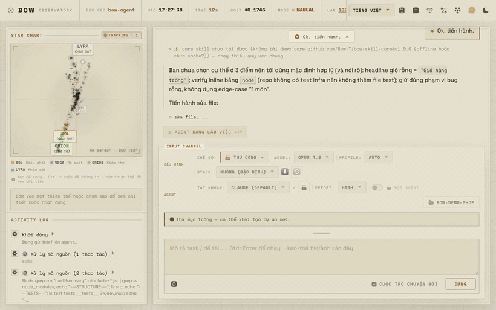

<h1 align="center">bow-agent</h1>

<p align="center">
  <b>A self-hosted AI coding agent your whole team can share — where every write is approved by a human.</b>
</p>

<p align="center">
  Point it at a Jira ticket, a spec doc, or a plain sentence. It plans first, you approve, then it executes —<br/>
  and every file edit, shell command, and database migration stops at a gate until someone says yes.
</p>

<p align="center">
  <a href="#quick-start">Quick start</a> ·
  <a href="#why-not-just-use-claude-code">Why not just use Claude Code?</a> ·
  <a href="#six-modes-one-agent">Six modes</a> ·
  <a href="#contributing">Contributing</a> ·
  <a href="README.vi.md">Tiếng Việt</a>
</p>

<p align="center">
  <a href="LICENSE"></a>
  = 18" src="https://img.shields.io/badge/node-%3E%3D18-brightgreen.svg">
  
  <a href="https://www.npmjs.com/package/@anthropic-ai/claude-agent-sdk"></a>
</p>

---

<p align="center">
  
</p>

<p align="center">
  <b>The agent found the bug and wrote the patch — then stopped.</b><br/>
  <sub>It cannot touch the file until you click. Every write works this way. There is no path around it.</sub>
</p>

---

## The problem

AI coding agents are good enough to trust with real work, and that's exactly the problem.

The moment an agent can edit files, run shell commands, and push migrations, "let it run and see" stops being a strategy. You end up babysitting a terminal — and everyone else on your team (QC, BA, tech lead, contractors) either gets no access to the agent at all, or gets an access level that terrifies you.

**bow-agent is the gate.** One agent core, running on your machine, with a permission boundary that everyone else works through.

## What it does

- **Plan first, execute after approval.** The default mode never touches your files. It reads the codebase, produces a plan, and waits. Only when you approve does it switch to execute mode.
- **Every write stops at a gate.** Read tools (grep, read, list) and safe shell commands run freely. Every *write* — `Edit`, `Write`, a `Bash` command with side effects, a Jira comment, a `execute_sql` — pops an approve/deny card. There is exactly one gate (`canUseTool`), and no path around it.
- **Share one agent with your whole team, by role.** Run it on your machine, share the LAN URL. A QC engineer gets a read-only agent that can triage Jira tickets. A BA can write docs but is hard-denied from touching source. A contractor can write code — but every single write, *including git*, is approved by you in real time from your machine.
- **It reads your project, not a generic one.** Point it at any repo with `--cwd`. It picks up that repo's `CLAUDE.md`, auto-detects the stack, and can generate a persistent knowledge profile for repos it's never seen.
- **Real integrations, gated the same way.** Jira (read tickets, attachments, even watch video attachments), Supabase (inspect the real DB, run advisors), GitHub PRs, Codemagic — all through MCP, all with reads free and writes gated.

## Why not just use Claude Code?

bow-agent is *built on* the Claude Agent SDK — the same engine as Claude Code. It isn't a replacement, it's a different shape around the same core:

| | Claude Code | bow-agent |
| --- | --- | --- |
| **Who uses it** | You, in your terminal | You + your QC, BA, tech lead, contractors — over LAN |
| **Permissions** | One user, one trust level | **Five role-based modes**, each with its own port and policy |
| **Remote approval** | — | Contractor's agent wants to write? **The card pops up on *your* screen.** |
| **Interface** | Terminal | Terminal **and** a web UI with approval cards, cost/context readouts, and chat history |
| **Ticket → code** | Manual | Paste a Jira URL — it pulls the ticket, ACs, images, and video attachments |

If you're a solo dev in a terminal, use Claude Code. If you want to hand an AI agent to people you don't want writing to `main`, that's this.

## Six modes, one agent

Same core, same safety gate, six permission profiles. Each runs on its own port, so you can run them **all at once**:

| Mode | Command | For | Can do | Cannot do |
| --- | --- | --- | --- | --- |
| **Dev** | `npm run ui` | You (admin) | Everything, with approval | — |
| **QC** | `npm run ui:qc:share` | QA engineers | Read source, triage Jira tickets, comment & transition issues | Touch a single line of code |
| **Collab** | `npm run ui:collab` | Contractors | Write code, run tests | **Anything that writes — including git — without your approval** |
| **BA** | `npm run ui:ba` | Business analysts | Write docs (`docs/`, `*.md`), full Jira | Source code, DB, deploy (hard-denied) |
| **Reviewer** | `npm run ui:review:share` | Tech leads | Review PRs, comment & approve on GitHub, run tests | Edit code, merge, push |
| **DevOps** | `npm run ui:devops:share` | Platform / infra engineers | Write infra files (Dockerfile, compose, `.github/workflows/*`, `*.tf`, k8s/Helm) & ops docs | Touch app source; deploy/apply is routed to admin for approval |

Admin is determined by **the real socket IP being localhost** — a LAN client cannot spoof `X-Forwarded-For` to seize control. LAN users request access by name and wait for you to approve them.

## Quick start

**Requirements:** Node ≥ 18, and the [Claude CLI](https://claude.com/claude-code) logged in (`claude` → `/login`). bow-agent uses your existing Claude subscription — no API key needed.

```bash
git clone https://github.com/Bow-T/bow-agent.git
cd bow-agent
npm install
npm run ui
```

Open **http://localhost:5173**, type a task, and watch it plan.

### Or from the terminal

```bash
# Plan only — touches nothing (this is the default)
npm run dev -- run --text "Add a copy-order-code button" --cwd ~/my-project

# Execute — every write asks for approval (y/N)
npm run dev -- run PROJ-123 --cwd ~/my-project --execute
```

Feed it any of three inputs, or combine them:

| Input | How |
| --- | --- |
| **Jira ticket** | `run PROJ-123` — or paste a full Jira URL, it extracts the key |
| **Spec / WBS file** | `run --wbs ./task.md` — see [`examples/task.example.md`](examples/task.example.md) |
| **Plain text** | `run --text "Fix the crash on the checkout screen"` |

## How it works

```
   Jira ticket / spec doc / plain text
                  │
         ┌────────▼─────────┐
         │  normalize task  │
         └────────┬─────────┘
                  │
   ┌──────────────▼──────────────────┐
   │  core/runner.ts  (Agent SDK)    │   ← CLI and Web share this. One core.
   │  + plan-then-approve prompt     │
   │  + project profile & skills     │
   │  + your repo's CLAUDE.md        │
   └──────────────┬──────────────────┘
                  │
        ┌─────────▼──────────┐
        │  canUseTool  🚪    │   ← THE gate. Reads pass. Every write stops here.
        └─────────┬──────────┘
             ┌────┴────┐
         approve      deny
             │
     files · shell · MCP (Jira/Supabase/GitHub)
```

The whole safety model is one function. If you're auditing this project, read [`canUseTool` in `src/core/runner.ts`](src/core/runner.ts) — that's the boundary, and nothing routes around it.

## What's inside

- **Skills load at runtime, not from this repo.** bow-agent is an empty frame: skills are fetched from allow-listed GitHub repos, pinned to a specific ref, and cached locally. Adding a skill doesn't mean forking this repo.
- **Multi-agent, opt-in.** `--subagents` lets the main agent delegate to specialists — a *reviewer* that argues against the plan, a *verifier* that traces runtime behavior end-to-end, an *impact-scout* that finds every call site before you change a contract. All of them are read-only; the main agent still does every write, still through the gate.
- **Auto-resume on rate limit.** Hit your 5-hour session cap mid-execution? It schedules a resume for when the limit resets and picks the work back up.

Full design docs: **[ARCHITECTURE.md](ARCHITECTURE.md)** · Vietnamese README: **[README.vi.md](README.vi.md)**

## Contributing

**Ideas are as welcome as code.** This started as an internal tool and is now open — if you've fought the "how do I let my team use an AI agent without giving them root" problem, I want to hear how you solved it.

- 💡 **Have an idea or a use case?** [Open a discussion](https://github.com/Bow-T/bow-agent/discussions) — no code required.
- 🐛 **Found a bug?** [Open an issue](https://github.com/Bow-T/bow-agent/issues).
- 🔧 **Want to build something?** Check [issues labeled `good first issue`](https://github.com/Bow-T/bow-agent/issues?q=is%3Aissue+is%3Aopen+label%3A%22good+first+issue%22), or read [CONTRIBUTING.md](CONTRIBUTING.md).

Things I'd love help with: **more role modes** (designer? PM? security reviewer?), **more stack profiles** beyond Flutter/Supabase, **auth for non-LAN sharing**, and **translations**.

## License

[MIT](LICENSE) — use it, fork it, sell it. Just keep the notice.

Built on the [Claude Agent SDK](https://www.npmjs.com/package/@anthropic-ai/claude-agent-sdk).
