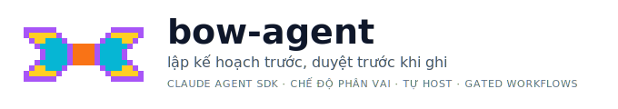

<p align="center">
  
</p>

<p align="center">
  <b>AI agent tự lập kế hoạch và thực thi code — chạy theo mô hình plan-then-approve (mọi thay đổi đều được kiểm soát qua gate duyệt).</b>
</p>

<p align="center">
  Chỉ cần trỏ agent vào bất kỳ repo nào qua <code>--cwd</code>, và dự án sẽ tự động được quét để tối ưu ngữ cảnh. Tích hợp sâu Jira, Supabase, và các chế độ phân quyền cực kỳ chi tiết cho nhóm (QC, BA, Reviewer, DevOps).
</p>

<p align="center">
  <a href="README.md">English version</a>
</p>

<p align="center">
  <a href="LICENSE"></a>
  = 18" src="https://img.shields.io/badge/node-%3E%3D18-brightgreen.svg">
  
  <a href="https://www.npmjs.com/package/@anthropic-ai/claude-agent-sdk"></a>
</p>

---

## Chuẩn hóa base source của team 🧩

bow-agent **là công cụ** (TS/Node + Claude Agent SDK) — *không* phải app Flutter. Nhưng
nó không phải công cụ trung lập: nó được **đóng khuôn theo base source chuẩn của team**.

### Base source chuẩn = Flutter + Supabase + Stripe + Jira + Mapbox

Mọi app của team dựng theo cùng một khuôn công nghệ và cùng một bộ quy ước. bow-agent
**mang sẵn chuẩn đó** trong một *base profile* (`src/profiles/base/app-base-flutter-supabase.md`)
— agent biết trước cách team dựng app trước cả task đầu tiên:

| Công nghệ | Chuẩn team mà agent áp sẵn |
| --------- | -------------------------- |
| **Flutter** | Cấu trúc `pages/components/services/models`, DI qua **get_it** (expose ở `base_vm`), state bằng **provider/ChangeNotifier**, routing **AutoRoute** (regen `.gr.dart`), model **@JsonSerializable** (regen `.g.dart`), mọi chuỗi qua **l10n**. |
| **Supabase** | Query gom trong `services/`, **RLS bắt buộc** cho bảng mới, đổi schema bằng **migration** (không sửa DB tay). Qua MCP: `list_tables`, `get_advisors`, `get_logs`… |
| **Stripe** | Logic tính tiền/charge **ở backend** (Edge Function), client chỉ khởi tạo PaymentSheet; key đọc từ env, không hardcode. |
| **Jira** | Nhận task từ ticket/board; đọc issue + AC trước khi làm; ghi comment/subtask (phải duyệt). |
| **Mapbox** | Token từ env (không hardcode); xử lý đúng quyền vị trí + case người dùng từ chối. |

### Vì sao điều này giúp dự án mới chạy nhanh 🚀

> **Dự án mới cùng khuôn → dùng `--profile app-base-flutter-supabase` → agent biết chuẩn team
> ngay từ task đầu**, không phải "dạy lại" từ đầu mỗi lần.

Hai tầng tri thức, từ chung tới riêng:

1. **Base profile (chuẩn team)** — viết tay, **được commit & chia sẻ**, áp cho *mọi* dự án
   cùng khuôn. Đây là "hiến pháp kỹ thuật". → mục [Base profile](#base-profile--chuẩn-team-dùng-lại-cho-mọi-dự-án) bên dưới.
2. **Profile tự sinh** (`generated-profiles/`) — agent quét một repo lạ rồi ghi kiến thức
   riêng repo đó (gitignore, per-máy).

Base profile là nền chung; profile tự sinh tinh chỉnh cho từng repo lạ. Riêng **monorepo
của team** có thêm một bó tri thức đóng gói sẵn (CLAUDE.md + skill + hook), tự kích hoạt
khi `--cwd` nằm trong monorepo — xem mục [Ngữ cảnh monorepo](#ngữ-cảnh-monorepo--gói-sẵn-tự-kích-hoạt) bên dưới.

---

## Cài đặt

```bash
cd bow-agent
npm install
```

### Xác thực Claude — qua Claude CLI login

bow-agent xác thực **bằng login Claude CLI** (không dùng API key). Nếu máy đã đăng nhập
(`claude` → `/login`, dùng gói Claude Pro/Max), bow-agent **dùng luôn login đó** — Agent SDK
spawn tiến trình `claude`, tiến trình đó tự đọc credentials ở `~/.claude`.

Chưa login? Chạy `claude` rồi `/login` một lần. Dòng banner khi chạy hiện `auth=Claude CLI login`
(hoặc `auth=CHƯA ĐĂNG NHẬP` nếu thiếu).

---

## Dùng qua Web UI (khuyến nghị) 🌐

Giao diện chat trên trình duyệt — gõ task, xem tiến độ, bấm nút duyệt.

```bash
npm run ui
```

→ Mở **http://localhost:5173**. Trong đó:
- Ô nhập **task / đề tài** (Ctrl+Enter để chạy) + ô **Jira** + ô **cwd** (thư mục repo).
- **Tự nhận diện source**: gõ `cwd` → agent tự đoán loại dự án (Flutter/Supabase/Node…) và gợi ý. Dòng 🔎 hiện kết quả nhận diện.
- **Jira URL hoặc key**: dán `PROJ-123` hoặc cả URL `/projects/PROJ/boards/123` — agent tự bóc ticket / board / project rồi đọc đúng. Ảnh/video đính kèm ticket cũng được tải để agent nhìn / xem (xem [ARCHITECTURE.vi.md](ARCHITECTURE.vi.md)).
- **Kéo-thả tài liệu, PDF & ảnh**: thả file WBS/spec (text/markdown), **PDF** (tự trích text) và ảnh (wireframe/screenshot) vào ô nhập, hoặc bấm 📎, hoặc dán clipboard. Agent đọc tài liệu và nhìn ảnh (vision).
- **7 nút gợi ý nhanh**: Sửa bug từ Jira · Làm theo đề xuất · Giải thích codebase · Viết test · Review & rà lỗi · Sinh commit/PR · Refactor/dọn code — bấm để chèn prompt mẫu.
- **Chọn stack skill**: dropdown chọn stack (Flutter / React Native / Next.js) → tải bộ skill tương ứng từ GitHub. Badge trạng thái + nút 🔄 **Đồng bộ** kéo bản mới nhất (chỉ admin).
- **Sinh profile cho repo lạ**: trỏ vào repo chưa biết → nút *Sinh profile* → agent quét repo (chỉ đọc) rồi lưu kiến thức vào `generated-profiles/`, lần sau dùng ngay.
- Toggle **Chế độ** (Kế hoạch / Thực thi) + **🤖 Đội agent** (bật multi-agent — chỉ admin) + **Effort**.
- **Model picker** + readout **Cost / Session / Context** (hạn mức tài khoản).
- Nút theme header xoay vòng **3 giao diện nền**: sáng (giấy da) → tối (mực đêm) → blueprint (bản vẽ), độc lập với **7 màu nhấn**.
- Khi agent muốn sửa file / chạy lệnh / ghi Jira → **thẻ duyệt** với nút **Cho phép / Từ chối**. Nút **Dừng** hủy giữa chừng.
- **Tự chạy tiếp khi hết hạn mức phiên (5h)**: phiên đang thực thi bị dừng → hệ thống tự lên lịch & resume khi hạn mức reset (tối đa 3 lần), UI hiện thẻ đếm ngược + nút huỷ.

`npm run ui` chạy cùng lúc backend (cổng 4000) + frontend Vite (cổng 5173).
Muốn 1 cổng duy nhất (production): `npm run ui:preview` → mở http://localhost:4000.

### Sáu mode chạy web (cổng riêng, chạy song song) 🔀

Cùng một backend, `BOW_*_MODE` bật các mode phân quyền khác nhau cho từng nhóm người dùng
qua LAN — **mỗi mode một cặp cổng riêng nên chạy đồng thời không đụng nhau**:

| Mode | Script | API / Web | Cho ai | Quyền |
| ---- | ------ | --------- | ------ | ----- |
| **Dev** (đầy đủ) | `npm run ui` | 4000 / 5173 | Chủ máy (admin localhost) | Full. Client LAN non-admin bị ép **plan** (read-only) |
| **QC** | `npm run ui:qc:share` | 4001 / 5174 | QC hỏi đáp / chấm ticket | **Read-only source** + tool **Skill** (qc-triage) + **Jira** read/write (comment/transition); whitelist tool đọc, ép model Sonnet, ẩn UI kỹ thuật |
| **Collab** | `npm run ui:collab` | 4002 / 5175 | Cộng tác viên code qua LAN | Sửa code + chạy test tự do; **mọi thao tác GHI (kể cả Git, rm, deploy) phải admin duyệt từ xa** |
| **BA** | `npm run ui:ba` | 4003 / 5176 | Business Analyst | Ghi **tài liệu** (`docs/`, `*.md`) + **full Jira**; DENY cứng source code / DB / deploy |
| **Reviewer** | `npm run ui:review:share` | 4004 / 5177 | Tech Lead / Reviewer | **Read-only code** + review PR (`git diff`, `gh pr view/diff`) + **comment/approve PR** (`gh pr comment`/`gh pr review`) + test/analyze + **Jira đọc**; DENY sửa code / merge / push / deploy |
| **DevOps** | `npm run ui:devops:share` | 4005 / 5178 | Kỹ sư Triển khai / Hạ tầng | Ghi **file hạ tầng** (Dockerfile, compose, `.github/workflows/*`, `*.tf`, k8s/Helm) + docs vận hành; **lệnh deploy/apply được chuyển tiếp cho Admin phê duyệt**; cấm sửa source code ứng dụng |

- **Admin = socket IP thật là localhost** (`127.0.0.1`) — không tin header `X-Forwarded-For`.
- **Cổng truy cập LAN**: client non-localhost phải **gửi yêu cầu (nhập tên)** rồi chờ admin
  duyệt trong LAN Dashboard; token cấp lưu ở `localStorage` của client. (Không phải "mã số".)
- **MCP riêng theo user**: user LAN đã duyệt tự quản một danh sách MCP riêng (token/DB riêng),
  **overlay chồng** lên MCP chung của admin (trùng tên → bản riêng thắng) — chạy cả trong QC/Collab.
- Đổi source (`cwd`) lúc chạy không cần restart: admin bấm **Source** trên header (hoặc
  `POST /api/qc-cwd`). Dừng riêng từng mode: `ui:qc:stop` / `ui:collab:stop` / `ui:ba:stop` / `ui:review:stop` / `ui:devops:stop`;
  `ui:stop` tắt sạch mọi cổng.

---

## Dùng qua Terminal (CLI)

Có thể chạy trực tiếp bằng `tsx` (không cần build) hoặc từ bản build:

```bash
# Chạy nhanh khi dev (không cần build)
npm run dev -- run --wbs ./examples/task.example.md --cwd ~/GitProject/my-project

# Hoặc sau khi build:
node dist/cli/index.js run PROJ-123 --cwd ~/GitProject/my-project
```

### Ba nguồn đầu vào (có thể kết hợp)

| Nguồn            | Cách dùng                                   |
| ---------------- | ------------------------------------------- |
| **Jira ticket**  | `run PROJ-123` (đọc qua MCP jira — mặc định bật) |
| **File WBS/đề tài** | `run --wbs ./task.md`                    |
| **Text trực tiếp** | `run --text "Thêm nút copy mã đơn hàng"` |

### Cờ

| Cờ                | Ý nghĩa                                                          |
| ----------------- | --------------------------------------------------------------- |
| *(mặc định)*      | **Chỉ lập kế hoạch** — agent không sửa file, chỉ trình kế hoạch  |
| `--execute`       | Thực thi thật; mọi thao tác GHI/side-effect đều hỏi duyệt (y/N)  |
| `--cwd <dir>`     | Repo agent làm việc (mặc định: thư mục hiện tại)                 |
| `--profile <name>`| Kiến thức dự án: `none` (mặc định), `app-base-flutter-supabase` (chuẩn team), hoặc profile tự sinh |
| `--subagents`     | Bật **multi-agent**: agent chính giao việc cho subagent chuyên biệt (reviewer / verifier / impact-scout). Mặc định TẮT. Xem mục [Multi-agent](#multi-agent--subagent-chuyên-biệt-opt-in) |
| `--mcp [names]`   | Bật MCP (Supabase/Jira/Codemagic…); **mặc định BẬT tất cả** (để đọc được Jira ticket). `--mcp jira,supabase` để giới hạn |
| `--no-mcp`        | Tắt hoàn toàn MCP (chạy offline, không đọc Jira/DB)              |
| `--effort <lvl>`  | `low\|medium\|high\|xhigh\|max` (mặc định `high`)               |
| `-h`, `--help`    | In hướng dẫn                                                     |

### Ví dụ

```bash
# 1) Lập kế hoạch cho một ticket (an toàn — không sửa gì)
bow-agent run PROJ-123 --cwd ~/GitProject/my-project

# 2) Nhận task từ WBS rồi thực thi (hỏi duyệt từng thao tác ghi)
bow-agent run --wbs ./examples/task.example.md --cwd ~/GitProject/my-project --execute

# 3) Kết hợp ticket + WBS bổ sung, effort cao nhất
bow-agent run PROJ-123 --wbs ./ac.md --execute --effort xhigh --cwd ~/GitProject/my-project
```

---

## Cách hoạt động

```
      đề tài / WBS / Jira ticket
                 │
        ┌────────▼─────────┐
        │  input/task.ts   │  chuẩn hóa thành "task brief"
        └────────┬─────────┘
                 │
        ┌────────▼──────────────────────────────────┐
        │   core/runner (Claude Agent SDK query)     │
        │   systemPrompt = preset Claude Code        │
        │     + quy trình plan-then-approve          │
        │     + PROJECT PROFILE (kiến thức repo)     │
        │     + skill chung + ngữ cảnh monorepo     │
        │   + đọc CLAUDE.md của repo                 │
        │   (+ subagents nếu --subagents)           │
        └───┬───────────────────────────────────────┘
            │
    ┌───────▼─────────┐
    │ tools & file    │
    │ MCP / bash /    │
    │ edit (GHI duyệt)│
    └─────────────────┘
```

### Chế độ & an toàn

- **`plan` mode** (mặc định): dùng `permissionMode: 'plan'` của SDK — agent khám phá + lập kế hoạch nhưng **không** sửa file/chạy lệnh.
- **`execute` mode**: agent thực thi, nhưng mọi tool GHI (Write/Edit/Bash có side-effect, `add_comment`, `create_subtask`) đi qua cổng `canUseTool` → hỏi duyệt trước khi chạy. Tool ĐỌC (Read/Grep/Glob, đọc Jira) tự cho phép.
- Agent đọc `CLAUDE.md` của repo đích (qua `settingSources: ['project']`), nên quy ước riêng từng dự án được tôn trọng tự động.

---

## MCP — dùng lại kết nối của Claude Code 🔌

Bow-agent nạp các MCP server (Supabase, Jira, Codemagic, Figma…) từ một file cấu hình **riêng
của bow-agent** — `~/.bow-agent/mcp.json`, **tách khỏi profile/tài khoản Claude đang login**
(seed lần đầu từ `~/.claude.json` để không mất cấu hình sẵn có). Nhờ tách file này, **đổi
tài khoản Claude qua lại không làm mất MCP**. Agent vì thế **mạnh ngang Claude Code** ở mảng
"kết nối thật":

- **Supabase**: xem DB thật (`list_tables`, `list_migrations`), quét lỗi (`get_advisors`), debug (`get_logs`), sinh types. Tool **đọc** tự chạy; tool **ghi** (`execute_sql`, `apply_migration`, `deploy_edge_function`) phải **duyệt**.
- **Jira**: đọc issue/board/search. **Codemagic**: build (phải duyệt).

**MẶC ĐỊNH BẬT tất cả** — để agent đọc được Jira ticket ngay từ đầu. Tùy chọn giới hạn/tắt:

```bash
bow-agent run PROJ-123               # (mặc định) nạp mọi MCP đã cấu hình
bow-agent run PROJ-123 --mcp jira    # chỉ nạp server jira
bow-agent run --text "..." --no-mcp  # tắt hoàn toàn (chạy offline)
```

> ⚠️ **Lưu ý bảo mật.** Claude Agent SDK truyền cấu hình MCP (kèm token) **qua tham số command-line**, nên khi MCP bật, bất kỳ ai chạy `ps aux` trên máy đều đọc được token trong lúc agent chạy. Dùng `--no-mcp` cho task không cần kết nối thật để giảm thời gian token lộ.

Token MCP nằm trong file cấu hình trên máy (`~/.bow-agent/mcp.json`, hoặc bản riêng của user
LAN ở `conversations/user-mcp.json`), **bow-agent không hardcode** — chỉ tham chiếu lúc chạy.

---

## Multi-agent — subagent chuyên biệt (opt-in)

Mặc định bow-agent chạy **single-agent** (một agent làm hết). Bật `--subagents` để agent
chính có thể **giao việc cho subagent chuyên biệt** qua tool `Agent` — mượn ý *role
specialization*, hiện thực bằng `Options.agents` của Claude Agent SDK (không bê framework ngoài):

```bash
bow-agent run PROJ-123 --execute --subagents --cwd ~/GitProject/monorepo/apps/mobile
```

| Subagent | Vai trò | Quyền |
| -------- | ------- | ----- |
| **reviewer** | Phản biện kế hoạch/diff trước khi trình duyệt: tìm call-site bỏ sót, rủi ro cross-cutting, over-engineering. | Chỉ đọc (`permissionMode: 'plan'`) |
| **verifier** | Kiểm chứng thay đổi đã làm: chạy test/analyze + trace luồng runtime end-to-end (không chỉ "compile pass"). | Đọc + chạy lệnh kiểm chứng |
| **impact-scout** | Quét blast radius khi đổi contract/enum/schema: liệt kê MỌI call-site + allow-list/switch liệt-kê-tay. | Chỉ đọc |

- **MẶC ĐỊNH TẮT.** Với repo nhỏ / task rõ, một agent tự làm đủ; subagent chỉ thêm chi phí token. Đáng bật cho **task lớn, cross-cutting** (repo thật như monorepo) nơi việc rà soát/kiểm chứng độc lập bù lại chi phí.
- Subagent đều **read-only / chỉ chạy lệnh kiểm chứng** (chặn cứng Edit/Write/commit/push). Mọi thay đổi thật vẫn do **agent chính** làm và **vẫn qua cổng duyệt** — bật multi-agent không nới lỏng an toàn.
- Profile có thể bổ sung subagent riêng (ghi đè bộ chuẩn nếu trùng tên); chỉ có tác dụng khi `--subagents` bật.

> Thiết kế đầy đủ: xem **[ARCHITECTURE.vi.md](ARCHITECTURE.vi.md)**.

---

## Skill — khung rỗng, tải từ GitHub 📦

bow-agent là **khung rỗng**: repo **không chứa data skill** (thư mục `skills/` đã gỡ; `src/skills/*.ts`
chỉ là code). Mọi skill tải từ repo GitHub lúc chạy, cache ở `~/.bow/skills-cache/<id>@<ref>`,
rồi trải vào `<cwd>/.claude/skills/` (gitignore) để SDK tự khám phá:

| Nguồn | Repo | Khi nào tải |
| ----- | ---- | ---------- |
| **CORE** | `Bow-T/bow-skill-core` | **Luôn** tải mỗi lần chạy (skill agent luôn cần: `watch`, `qc-triage`, coding-convention) |
| **STACK** | `bow-skill-flutter` / `-react-native` / `-nextjs` | Tải **khi chọn stack** trên UI (repo Flutter còn kèm ngữ cảnh monorepo) |
| **Repo đích** | `.claude/skills/` của repo bạn trỏ vào | Tự có nhờ `settingSources:['project']` (không đụng skill người dùng) |

- **Registry** (allowlist stack + repo core, kèm `ref` ghim tag/commit) nằm **ngoài repo**, ở
  `~/.bow-agent/registry.json` — seed lần đầu từ `DEFAULT_REGISTRY` trong `src/config/env.ts`,
  override qua env `BOW_REGISTRY`. Admin sửa file này để ghim ref / thêm stack, **không cần sửa code**.
- **An toàn**: chỉ tải repo trong allowlist, luôn checkout theo `ref` đã duyệt (không lấy nhánh
  trôi nổi), cache bất biến theo `<id>@<ref>`. Fail-open: offline sau lần đầu vẫn chạy từ cache.
- Chọn stack qua **UI** (web) — CLI hiện không có cờ `--stack`, chạy CLI chỉ có skill CORE.

---

## Ngữ cảnh monorepo — gói sẵn, tự kích hoạt

Toàn bộ `.claude` của monorepo (CLAUDE.md + skill + hook) được **tải từ repo skill stack**
(`Bow-T/bow-skill-flutter`, thư mục `monorepo/` — clone về `~/.bow/skills-cache/`), nên khi
`--cwd` nằm trong monorepo, agent tự áp:

- **CLAUDE.md** (quy ước dự án) đưa nguyên vào system prompt.
- **Danh mục skill** (name + description + đường dẫn) — agent tự `Read` full `SKILL.md` khi task khớp, tránh nhồi cả nghìn dòng vào mọi lượt.
- **Hook** (`guard-push`, `guard-commit-branch`, `self-verify-rubric`, `ensure-githooks`) — chặn push khi quest gate fail, chặn commit trên branch protected, nhắc rubric.
- **Tự nhận mã dự án Jira** (`<PROJECT_KEY>`) từ branch/commit/`.env` rồi map placeholder trong skill sang mã thật.

Nguồn không nằm trong bow-agent — không đụng `.claude` của monorepo. Khi monorepo đổi
skill/hook, cập nhật trong repo `Bow-T/bow-skill-flutter` (thư mục `monorepo/`); bow-agent
tự clone bản mới nhất mỗi lần chạy khi chọn stack Flutter.

---

## Base profile — chuẩn team dùng lại cho mọi dự án 🧩

Base profile là **kiến thức chuẩn viết tay**, được **commit vào repo** (khác profile tự
sinh — vốn gitignore). File nằm ở `src/profiles/base/*.md`. Hiện có:

| Profile | Dùng cho |
| ------- | -------- |
| `app-base-flutter-supabase` | App team dựng theo khuôn **Flutter + Supabase + Stripe + Jira + Mapbox** |

**Dùng cho một dự án mới cùng khuôn:**

```bash
bow-agent run PROJ-123 --profile app-base-flutter-supabase --cwd ~/GitProject/new-app --execute
```

Agent lập tức áp chuẩn team: cấu trúc thư mục, DI qua get_it, AutoRoute/regen, RLS bắt
buộc, l10n, Stripe ở backend… — không phải khám phá lại từ đầu.

**Tạo/cập nhật chuẩn:**

1. Sửa hoặc thêm file `.md` trong `src/profiles/base/` (một dự án = một profile, hoặc
   dùng chung nếu cùng khuôn). Viết **thực tế, ngắn gọn**, tập trung vào quy ước + cạm bẫy.
2. Commit — cả team và mọi dự án dùng ngay.

> **Base profile là gợi ý mạnh, không phải luật cứng.** Prompt dặn agent: nếu thực tế repo
> mâu thuẫn với một mục trong profile → **tin repo**. Khi phát hiện chuẩn đã lỗi thời, sửa
> lại file base và commit — đó là cách chuẩn của team tiến hóa có kiểm soát.

---

## Jira — đọc qua MCP

Bow-agent đọc/ghi Jira **hoàn toàn qua MCP** (server `jira`, cấu hình trong file MCP chung
`~/.bow-agent/mcp.json`) — **không** còn REST client riêng, **không** cần điền `JIRA_*` trong `.env`.

- **Đọc** (tự cho phép): `jira_get_issue`, `jira_get_comments`, `jira_search_issues`…
- **Ghi** (phải duyệt): `jira_add_comment`, `jira_create_subtask`, `jira_transition_issue`…

Chỉ cần đảm bảo đã cấu hình MCP jira (panel MCP của web, hoặc seed sẵn từ `~/.claude.json`).
Trên **CLI**, MCP bật mặc định nên chỉ cần dán ticket là chạy. Trên **Web**, chọn server `jira`
ở panel MCP. Tùy chọn `BOW_PROJECT_KEY` (hoặc `JIRA_PROJECT_KEY`) trong `.env` để cố định mã
dự án nếu không muốn agent tự đoán từ git branch.

> Ngoài text, ảnh & video đính kèm ticket được tải riêng (REST có auth, lấy token từ block
> `jira` trong file MCP) để agent **nhìn ảnh** (vision) và **xem video** (skill `/watch`) —
> xem [ARCHITECTURE.vi.md §7.1–7.2](ARCHITECTURE.vi.md).

---

## Cấu trúc

```
src/
  config/env.ts       # đọc .env + đường dẫn MCP chung/registry (nguồn duy nhất đọc process.env)
  input/task.ts       # chuẩn hóa đầu vào (ticket / WBS file / text)
  input/jira-ref.ts   # bóc Jira URL/key → ticket / board / project
  input/jira-attachments.ts # tải ảnh/video đính kèm ticket (REST + auth) cho vision & /watch
  input/pdf.ts        # trích text từ PDF upload
  tools/mcp.ts        # nạp/ghi MCP chung (~/.bow-agent/mcp.json) + quản lý qua UI (add/remove)
  profiles/
    index.ts          # registry profile (chọn qua --profile/UI): static → base → tự-sinh
    base/             # profile CHUẨN của team (committed) — app-base-flutter-supabase.md
    detect.ts         # tự nhận diện stack repo (Flutter/Supabase/Node…)
    generate.ts       # agent quét repo lạ → sinh profile (generated-profiles/, gitignore)
    workspace.ts      # workspace = nhiều repo + trí nhớ tích lũy (shared.md/journal.md)
  core/
    systemPrompt.ts   # quy trình chung của agent (append vào preset Claude Code)
    runner.ts         # LÕI agent: query() + profile + skill + subagents + mode + cổng duyệt
    subagents.ts      # bộ subagent chuẩn (reviewer/verifier/impact-scout) — opt-in
  skills/             # KHUNG RỖNG: chỉ CODE, không chứa data skill (tải từ GitHub lúc runtime)
    index.ts          # gộp skill prompt-only vào system prompt (từ bản clone bow-skill-core)
    agentSkills.ts    # trải skill-kèm-code vào <cwd>/.claude/skills/ (STAMP phân nguồn)
    externalSkills.ts # tải skill GitHub: CORE luôn tải + STACK khi chọn (cache ~/.bow/skills-cache)
    monorepo.ts       # nhận diện monorepo + nạp CLAUDE.md + danh mục skill (từ repo stack clone)
    hooks.ts          # bọc hook shell của monorepo thành SDK hook (guard/verify)
  cli/index.ts        # entrypoint CLI (dùng lõi runner + terminal y/N)
  web/
    server.ts         # backend Express: /api/run, SSE, duyệt, 4 mode, access gate, auto-resume
    session.ts        # phiên chạy + hàng đợi sự kiện + adminBus (duyệt từ xa cho Collab)
    access.ts         # cổng truy cập LAN: xin duyệt theo tên → admin cấp token
    userMcp.ts        # MCP riêng theo user LAN (overlay lên MCP chung)
    conversations.ts  # lịch sử chat (tách theo IP), chat.ts # chat nhóm
web/                  # frontend React (Vite) — chat, thẻ duyệt, 3 theme + 7 accent, model/cost,
                      # quick prompts, panel MCP/workspace/skill, LAN dashboard
  App.tsx, main.tsx, styles.css, types.ts, và các component (NeuralBrain, AccentPicker…)
examples/
  task.example.md     # WBS mẫu
generated-profiles/   # profile tự sinh (gitignore, per-máy)
memory/               # audit log LAN theo IP (gitignore)
```

> **CLI và Web dùng chung lõi** `core/runner.ts` — khác nhau chỉ ở cách hiển thị (terminal vs SSE) và cách duyệt (gõ y/N vs bấm nút). Không trùng logic.

---

## Ghi chú

- **Model**: `claude-opus-4-8`. CLI luôn chạy model này; Web UI cho chọn model khác qua giao diện.
- **Node ≥ 18** (dùng `fetch` gốc, ESM).
- Agent **không** tự commit/push/apply-migration trừ khi bạn yêu cầu rõ và duyệt.
