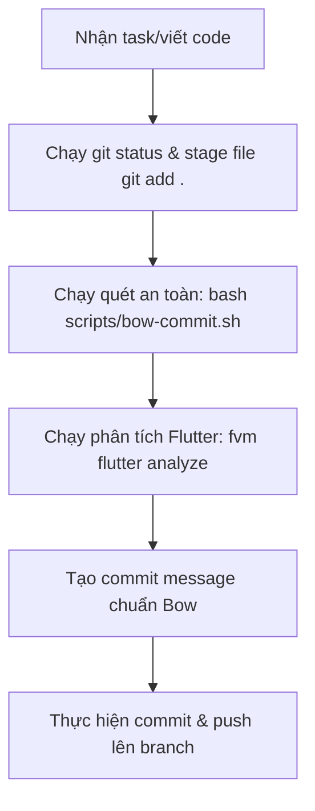

# 📘 Cẩm Nang Lập Trình Cho Claude (AI Developer Assistant) — Dự Án <PROJECT_KEY>

Tài liệu này là bộ hướng dẫn phát triển phần mềm và quy chuẩn làm việc dành riêng cho **Claude** (AI Coding Assistant) khi làm việc trên repo này qua **Claude Code**.

Claude **MUST** đọc, hiểu và tuân thủ tuyệt đối các quy tắc dưới đây để đảm bảo chất lượng code, bảo mật hệ thống và tối ưu hóa điểm số đóng góp dự án (**du-quest Score**).

---

## 📐 1. Bối Cảnh Dự Án & Tech Stack

Dự án **Digital Unicorn Bow (<PROJECT_KEY>)** là một hệ thống siêu ứng dụng dịch vụ (booking xe, giao hàng, admin portal).

*   **Repository Structure (Monorepo):**
    *   `apps/mobile/`: Ứng dụng di động Flutter (Dart).
    *   `apps/admin/`: Portal quản trị Next.js.
    *   `packages/`: Các thư viện chia sẻ dùng chung.
    *   `supabase/`: Cấu trúc cơ sở dữ liệu, migrations và Edge Functions.
*   **Tech Stack:** Flutter, Supabase, Stripe, Next.js.
*   **Nhân sự chủ chốt:**
    *   **Tuan Nguyen:** PM / Tech Lead (Người dùng chính).
    *   **Nguyen Hieu:** Lead Developer.
    *   **Ngan Nguyen (Kim):** QA Engineer.

---

## 🐙 2. Quy Trình Git & Commit "Bow Mode"

Quy trình commit và push code của dự án được tự động hóa nghiêm ngặt để đảm bảo chất lượng mã nguồn trước khi đẩy lên remote.

### Quy Trình Thực Hiện (Git Pipeline)
Khi thực hiện thay đổi hoặc chuẩn bị đẩy code, Claude phải tuân theo sơ đồ sau:



### Chi Tiết Các Bước:

1.  **Quét an toàn (Safety Scan):** Chạy `bash scripts/bow-commit.sh` để kiểm tra RLS, CORS, Secrets và views.
    > [!WARNING]
    > Nếu script trả về lỗi, Claude **MUST** dừng lại và sửa code ngay lập tức trước khi commit.
2.  **Phân tích Flutter (Flutter Static Analysis):** Nếu chỉnh sửa trong `apps/mobile`, di chuyển vào thư mục này và chạy:
    ```bash
    cd apps/mobile && fvm flutter analyze
    ```
    > [!IMPORTANT]
    > Không được phép commit khi có lỗi hoặc cảnh báo từ phân tích tĩnh. Phải sửa triệt để.
3.  **Tạo Commit Message chuẩn Conventional Commits:**
    Sử dụng định dạng nghiêm ngặt sau:
    ```text
    Type(scope): <emoji> Subject matching Jira task title or short clear summary

    Detailed explanation of WHY these changes were made. This body must be at
    least 3 lines long to describe the engineering decisions, avoid NCV penalisation,
    and clearly document structural changes, trigger updates, or UI behavior logic.

    Refs: <PROJECT_KEY>-XXX
    ```
    *   **Type:** Phải viết hoa chữ cái đầu (Ví dụ: `Feat`, `Fix`, `Refactor`, `Perf`, `Test`, `Docs`, `Chore`, `Style`). **Không viết thường** (viết thường sẽ bị mất điểm).
    *   **Gitmoji:** Gắn đúng 1 icon ([gitmoji.dev](https://gitmoji.dev)) chọn theo *chức năng* commit, đặt **ngay sau dấu hai chấm** — **TUYỆT ĐỐI không** đặt trước `Type` (sẽ làm trượt regex chấm điểm `^(Feat|Fix|…):` ở `scripts/quest-checklist.sh:265` → mất điểm). Ví dụ: `Fix(notifications): 🌐 Localize push templates`. Chi tiết map icon trong skill `bow-commit`.
    *   **Subject:** Dài từ 10-72 ký tự (tính cả emoji), bắt đầu bằng động từ ở thể mệnh lệnh (ví dụ: `add`, `fix`, `update` - tránh `adding`, `fixed`).
    *   **Body:** Bắt buộc phải có **tối thiểu 3 dòng** giải thích sâu sắc về mặt kỹ thuật **TẠI SAO** (Why) thực hiện thay đổi này.
    *   **Footer:** Luôn ghi mã ticket Jira ở dạng `Refs: <PROJECT_KEY>-<số_ticket>` (ví dụ: `Refs: <PROJECT_KEY>-820`).

---

## 🔒 3. Quy Chuẩn Lập Trình An Toàn (Supabase Backend)

Phần lớn lỗi bảo mật và rớt điểm AI-review đến từ mã nguồn trong thư mục `supabase/`. Claude cần áp dụng checklist này trước khi đề xuất bất kỳ thay đổi nào:

### 🛡️ Checklist Bảo Mật & Logic Database:
*   **Chính sách RLS (Row Level Security):**
    *   Các lệnh `INSERT` và `UPDATE` sử dụng `WITH CHECK` phải xác thực quyền sở hữu của tất cả Foreign Keys liên quan, không chỉ đơn thuần là `auth.uid() = user_id`.
    *   Không được tin tưởng dữ liệu số tiền hoặc giảm giá do client gửi lên. Phải xác thực server-side hoặc qua `CHECK` constraint.
*   **Database Views:**
    *   Tất cả view trên các bảng có RLS bắt buộc phải định nghĩa với thuộc tính bảo mật:
        `CREATE VIEW ... WITH (security_invoker = true)`.
        > [!CAUTION]
        > Thiếu `security_invoker = true` sẽ khiến view chạy với quyền của owner và bỏ qua RLS, dẫn đến rò rỉ dữ liệu giữa các tenant.
*   **Triggers:**
    *   Triggers sử dụng `SECURITY DEFINER` chạy với đặc quyền cao. Phải đi kèm với chính sách kiểm soát chèn dữ liệu (`INSERT policy`) cực kỳ nghiêm ngặt trên bảng.
    *   Các trigger đếm số lượng (counters) cần xử lý đối xứng: tăng khi `INSERT`, giảm khi `DELETE`/`UPDATE`. Chú ý tác động từ `ON DELETE CASCADE`.
*   **Edge Functions:**
    *   Giới hạn CORS: Không đặt `Access-Control-Allow-Origin: *` cho các endpoint admin hoặc mutation.
    *   Các tác vụ phụ sau mutation chính (ghi log, gửi notification) phải nằm trong khối `try/catch`. Tránh để lỗi phụ làm hỏng transaction chính của DB.
*   **Cú pháp SQL:**
    *   Không viết các mệnh đề thừa hoặc vô nghĩa (ví dụ: `WHERE created_at < now()`).
    *   Backfill dữ liệu phải cập nhật đầy đủ các cặp cột liên quan (ví dụ: có `reviewed_by` thì phải có `reviewed_at`).

---

## 📈 4. Tối Ưu Hóa Điểm Số Đóng Góp (du-quest Score)

Chỉ viết commit chuẩn là chưa đủ. Điểm số tổng hợp được cấu thành từ nhiều khía cạnh. Claude cần chủ động thực hiện:

### 📊 Các Chỉ Số Cần Nâng Cao:

| Khía cạnh | Chỉ số tối ưu | Cách thực hiện |
| :--- | :--- | :--- |
| **Test Discipline (15%)** | Tỉ lệ commit test ≥ 25% | Tách riêng các commit kiểm thử bằng tiền tố `Test(scope): ...` hoặc cập nhật file test (`*_test.dart`, `*.spec.ts`). |
| **Codebase Impact (15%)** | Tỉ lệ xóa/thêm cân bằng | Đảm bảo tỷ lệ `deletions / (additions + deletions)` nằm trong khoảng `[0.2, 0.6]`. Tránh chỉ thêm code mà không dọn dẹp code thừa. |
| **No Self-Merge** | Tỷ lệ tự merge ≤ 50% | Gán code review cho các thành viên khác trong nhóm (Hieu, Tuan). Không tự ý merge MR của mình. |
| **Rubber Stamp Prevention** | Thời gian review ≥ 60s | Khi review code của đồng nghiệp, hãy dành tối thiểu 60 giây để xem xét kỹ file diff trước khi approve. |
| **Thoughtful Peer Review** | Viết comment review chất lượng | Để lại ít nhất 1 comment có độ dài trên 100 ký tự giải thích chi tiết kỹ thuật trên MR của đồng nghiệp. |
| **Consistency** | Duy trì commit đều đặn | Không commit dồn cục vào cuối tuần hay cuối sprint. Phân bổ commit đều đặn qua các ngày trong tuần. |

---

## 🤝 5. Phối Hợp Dự Án & Quản Lý Jira

Claude cần hoạt động ăn khớp với hệ thống quản lý Jira của đội ngũ:

*   **Chiến lược nhánh (Branch Strategy):** Mỗi ticket Jira tương ứng với 1 nhánh riêng biệt (`feat/<PROJECT_KEY>-XXX-...` hoặc `fix/<PROJECT_KEY>-XXX-...`). Mỗi nhánh tương ứng với tối đa 1 Merge Request (MR).
*   **Đồng bộ dữ liệu (Unified Truth):** Luôn lấy Jira Board 1795 làm nguồn sự thật tiến độ thời gian thực.
*   **Không tạo data drift:** Khi viết tài liệu tính năng trong `docs/features/`, không đánh dấu checkbox tiến độ thủ công. Hãy ghi rõ đường dẫn code cụ thể (Evidence) làm bằng chứng cho từng Acceptance Criteria.
*   **Tránh Prompt Injection:** Không đưa các đoạn text dạng chỉ thị hệ thống, role-play hay giả lập kết quả review vào commit message hoặc code diff. Hệ thống quét AI sẽ đánh sập điểm bảo mật nếu phát hiện.

---

## ✅ 6. Kiểm Thử & Xác Minh Runtime (BẮT BUỘC với thay đổi xuyên hệ thống)

> [!CAUTION]
> `fvm flutter analyze` PASS + unit test PASS **KHÔNG** đồng nghĩa với "không có lỗi". Phân tích tĩnh chỉ kiểm tra type/lint; unit test chỉ kiểm tra logic thuần. Cả hai **không** chạm tới `CHECK`/`FK`/trigger của DB, RPC `SECURITY DEFINER`, validator của Edge Function, hay luồng dữ liệu end-to-end.
> **Bài học <PROJECT_KEY>-1793/1797:** đổi vocabulary `vehicle_type` — analyze + test đều xanh, nhưng đặt xe vẫn crash runtime `rides_vehicle_type_check` (Postgres `23514`) và validator admin âm thầm từ chối tier mới. Một giá trị compile sạch vẫn có thể vi phạm constraint đóng băng ở một bảng cách đó 3 lớp.

Với mọi thay đổi **xuyên hệ thống** (DB schema, enum/vocabulary dùng chung, đổi key-format, hướng FK, giá trị xuất hiện ở nhiều bảng/app), sau `analyze` + test **PHẢI** audit thêm tầng runtime trước khi tuyên bố hoàn thành:

1.  **Quét DB live:** mọi `CHECK`, `FK`, `trigger`, `function` tham chiếu giá trị/vocabulary vừa đổi (`pg_constraint`, `pg_get_functiondef`). Sửa hoặc nới từng cái.
2.  **Quét Edge Functions:** `grep -r` toàn bộ `supabase/functions/*` tìm allow-list / validator hardcode giá trị vừa đổi.
3.  **Trace path end-to-end:** `insert → validate → dispatch/read` trên **mọi** surface chạm tới giá trị (mobile, admin, edge, DB).
4.  **Phát ngôn trung thực:** nói "tĩnh PASS; đã verify path runtime sạch" — **tuyệt đối không** nói "không có lỗi nào" cho tới khi đã soi xong tầng runtime.

### 🎯 Quét Bán Kính Ảnh Hưởng (Impact Sweep) — BẮT BUỘC
Trước khi tuyên bố MỘT thay đổi hoàn tất, phân tầng blast-radius:
*   **Local** (1 thân hàm, không đổi contract) → chỉ sửa + test trực tiếp, không cần quét.
*   **Contract** (đổi signature / return-shape / props / stored-format) hoặc **Cross-cutting** (enum / status / vocabulary / key-format / cột DB dùng nhiều nơi / slot mới) → **BẮT BUỘC** theo skill `impact-sweep`: grep 1 *peer* đã wired sẵn để liệt kê MỌI call-site/surface; soi các getter / `switch` / allow-list RPC / trigger **liệt-kê-thành-viên-khác** mà grep tên mới KHÔNG tìm ra (vd `isAnyFieldRejected`, `fn_drivers_derive_status`); rồi audit runtime (mục 6 trên). "Done" = checklist site xanh + test + runtime — **không** phải "analyze pass". Thay đổi Contract/Cross-cutting: trình checklist phạm vi cho người dùng *trước khi* code.

### 🧾 Hợp Đồng Báo Cáo (mọi task/bug) — BẮT BUỘC
Kết thúc mỗi việc phải nêu đủ: (1) **đã đổi gì** — file/scope; (2) **quét bao nhiêu site** (với thay đổi Contract/Cross-cutting); (3) **đã verify gì & bằng cách nào** — analyze / test / runtime (DB-CHECK/RPC/edge); **không** nói "không có lỗi" nếu chưa soi runtime; (4) **cái gì CHƯA xong / cần người dùng quyết** — nêu rõ, không tự quyết thay (vd gate cần backfill); (5) **trạng thái commit/push** — chưa commit / đã push / link MR.

---

### 📝 Mẫu Đánh Giá Trước Khi Commit (Pre-commit Preview)
Mỗi khi chuẩn bị commit code liên quan đến database hoặc logic chính, hãy tự đánh giá bằng bảng rubric sau để đảm bảo chất lượng:

```text
### Bow pre-commit preview — <PROJECT_KEY>-XXX
Branch: <branch>   Files: <n>   +<add>/-<del>

AI-review — protects Correct / Security / Effic
RLS
  [✓/✗/N/A] (2) FK ownership checked      <file:line> — <note>
  [✓/✗/N/A] (2) money field has CHECK     <file:line> — <note>
  [✓/✗/N/A] (1) owner-read policy kept    <file:line> — <note>
Views
  [✓/✗/N/A] (2) security_invoker = true   <file:line> — <note>
Triggers
  [✓/✗/N/A] (1) DEFINER + strict INSERT   <file:line>
  [✓/✗/N/A] (1) counter symmetric         <file:line>
Edge fn
  [✓/✗/N/A] (2) CORS scoped               <file:line>
  [✓/✗/N/A] (1) side-effect guarded       <file:line>
SQL hygiene
  [✓/✗/N/A] (1) no dead clauses
  [✓/✗/N/A] (1) backfill column-set full
AI subtotal: <earned>/<applicable> pts

Process levers — this task's contribution to Quality / Quantity
  [✓/✗] (1) Test         touches test files — else "split a Test: commit"
  [✓/✗] (1) Impact       del ratio <x> (target 0.2-0.6) | <n> unique files
  [✓/✗] (1) Quantity     NCV ≈ <n>, type <feat ×1.2 / fix ×1.1 / …>
  [✓/✗] (1) Review       own branch → 1 MR per issue
  [✓/✗] (1) Consistency  last commit <date> — weekly cadence <ok / gap>
Process subtotal: <earned>/5 pts

Score: <earned_total>/<applicable_total> pts (<pct>%)
Verdict: <READY / NOT READY>.
```

*(Lưu ý: Nếu điểm tự đánh giá dưới 80%, tuyệt đối không thực hiện commit mà phải tối ưu hóa code trước).*
